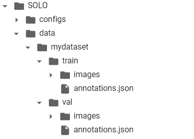
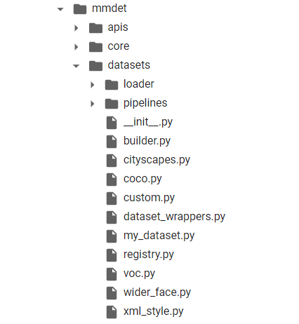
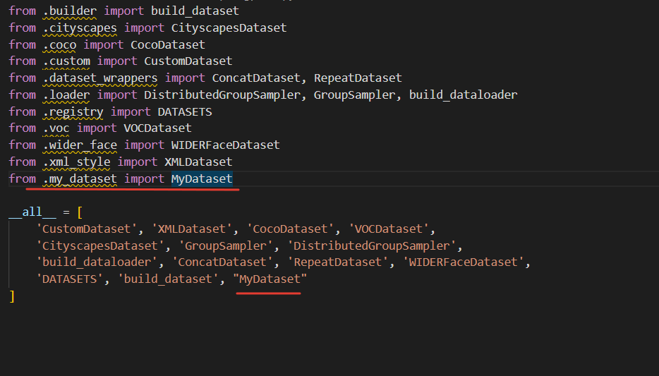
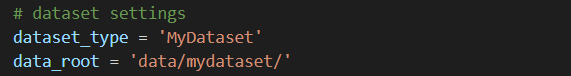
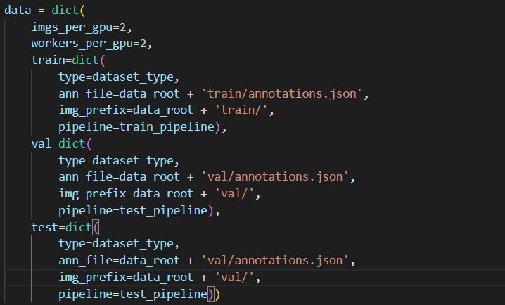
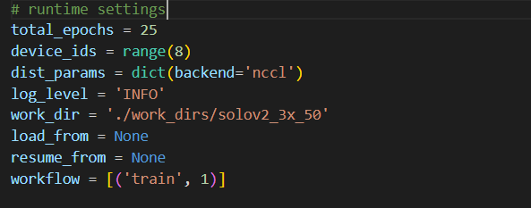

## SOLOv2_Google_Colab
### Train SOLOv2 on custom dataset with google colab

#### Create data/mydataset folders under SOLO folder


#### Create my_dataset.py under mmdet/datasets


Inside my_dataset.py:

```py
from .coco import CocoDataset
from .registry import DATASETS
@DATASETS.register_module
class MyDataset(CocoDataset):
    CLASSES = ['Your', 'Classes', ...]
```

#### Under mmdet/datasets edit `__init__.py`


#### Edit your config file.

##### Edit your number of classes 


##### Edit dataset settings



##### Runtime settings

